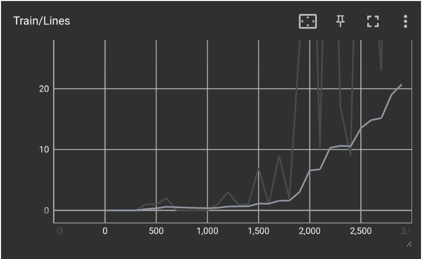
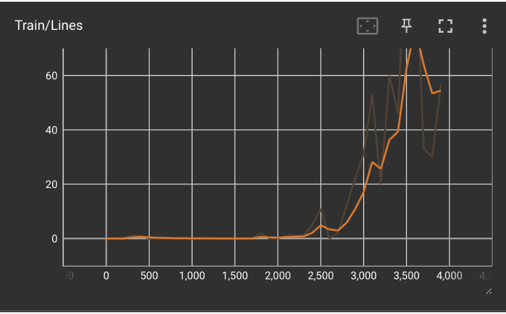
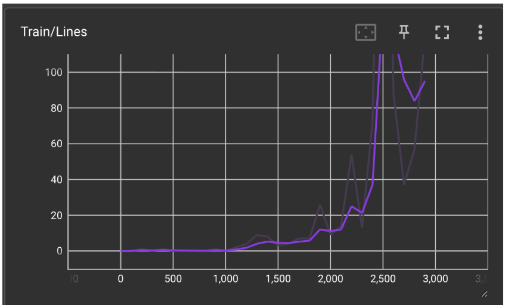
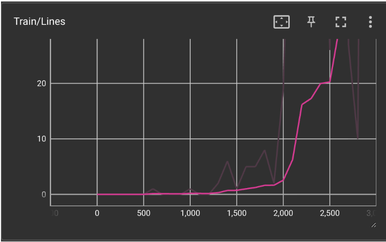
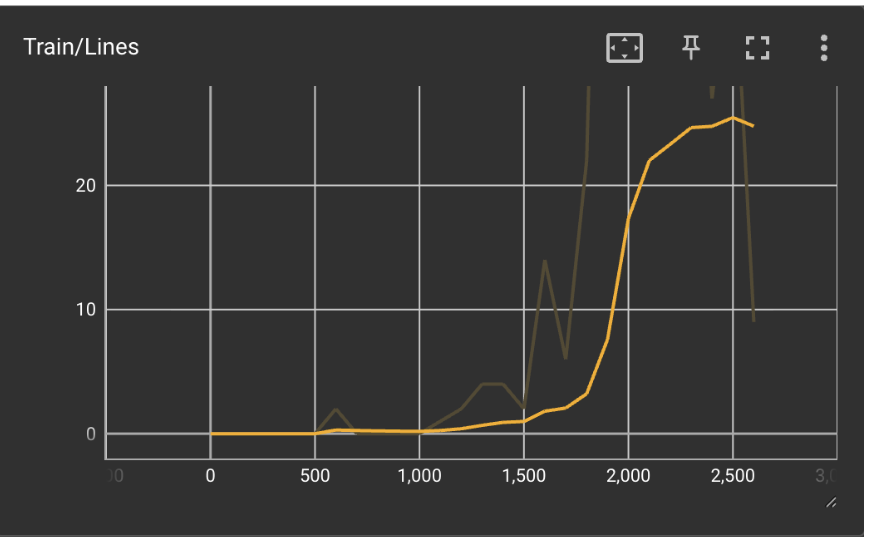

### Video

(link)

### Repository Links

[DQN model on custom PyGames environment](https://github.com/abby-liao/tetrisRL/tree/main)

[PPO model on ALE Environment](https://github.com/medhab123/Tetris_AI)

## Project Summary

The goal of TetrisRL is to train reinforcement learning agents to play classic Atari Tetris well, ultimately in a way that is similar to how a good human player would approach the game. Tetris is actually a pretty tough environment for RL: even though the rules are simple – blocks fall, stack them, line clears – you need to think several steps ahead, understand spatial relationships, and constantly adapt to random pieces coming in. It is very different from something like Breakout or Pong, where you are mostly just reacting to what is on the screen. In Tetris, one bad placement can snowball into an unwinnable board, and it is hard to tell which earlier decision caused the problem. This phenomenon is called the temporal credit assignment problem, one of the big unsolved challenges in RL. Tetris also allows for intuitive evaluation because it is easy to tell just by watching a game whether an agent is playing smart or just randomly dropping pieces.

We built two separate RL pipelines and ran them in parallel, which also gave us a natural way to compare how the choice of algorithm and exploration strategy affects learning. The first approach uses a CNN-based agent trained with PPO (Proximal Policy Optimization) in the Gymnasium/ALE Tetris environment. The second uses a DQN (Deep Q-Network) agent, which we tested in both a custom PyGame Tetris environment we built ourselves and the ALE environment, so we could compare it directly with the PPO agent. Our main goals were: build an end-to-end training pipeline for Tetris, run experiments to examine what environment settings and training choices improve gameplay, look at reward curves and game footage to understand what the agents are doing, and explore what leads to higher and more consistent scores.

## Approach

We train and compare two distinct RL agents on Tetris. We use a controlled experimental methodology: rather than changing multiple variables at once, we establish a stable baseline for each agent and then vary one aspect at a time — environment configuration, reward shaping, or hyperparameters — comparing the resulting learning curves and episode scores to isolate what actually drives improvement.

### Agent 1: CNN + PPO (ALE Environment)

The first agent used the ALE/Tetris-v5 environment from Gymnasium, which runs the original Atari 2600 version of Tetris. There are some limitations in this environment that make learning for the agent more difficult: the agent can't see the next piece, the scoring is based on line clears rather than using the standard scoring system, and the game speed doesn't change. Furthermore, the agent cannot do moves that human players can do, such as fitting blocks into tight spaces, due to the way collision/legal block placement is defined. The agent gets raw screen pixels as input and picks from a set of discrete actions. We applied the usual Atari preprocessing steps: converting to grayscale, stacking 4 frames to enable the agent to track piece movement, skipping every 4 frames to reduce redundancy, and normalizing pixel values. The input is flattened into a vector before entering the policy network.

We used Stable Baselines3's PPO with a CNN policy. PPO is an on-policy method that clips policy updates so that training doesn't go off the rails from a single bad batch. One downside in Tetris specifically is that PPO learns a probability distribution over actions, so it doesn't account for context; the same action might be great in one board state and terrible in another. We trained for about 1 million timesteps on the HPC cluster and logged everything to TensorBoard. We ran a bunch of experiments swapping out different wrappers, normalization settings, and training lengths, always comparing back to our original baseline.

Hyperparameters (mostly Stable Baselines3 defaults):
•      Learning rate: 3 × 10⁻⁴
•      n_steps: 2048
•      Batch size: 64
•      Discount factor γ: 0.99
•      Clip range ε: 0.2
•      Total training: ~1 million timesteps

First, we recorded the agent’s performance with all default settings and no optimization, pictured below.

As expected, the agent performs incredibly poorly. The agent is unable to score any points, and at best can survive for a small period of time without dying. There was also significant fluctuation throughout the training period.

Thus, we added some environment preprocessing, such as environment wrappers and normalization. The following graphs show the performance of the agent with a vector environment, AtariWrapper, and VecFrameWrapper:

The vectorized environment included normalization, and runs multiple copies of the environment simultaneously to speed up training time. AtariWrapper was chosen to make the environment easier to manage for the agent, and adds. VecFrameWrapper was used to give the agent a sense of time (the agent takes in the last n images as a stack, rather than viewing each frame individually). With environment preprocessing, the agent performs much better and consistently higher than the agent without any. Thus, we used the enhanced environment to test hyperparameters on.

The hyperparameters we tested on the PPO included the following:
gamma (γ) (default = 0.99) - the variable that determines whether long-term or short-term rewards are prioritized. higher gamma prioritizes long-term rewards
clip range (default = 0.2) - the range that the policy can update within. greater clip range allows for more drastic changes
entropy coefficient (default = 0.0) - variable that tries to prevent PPO from converging too early

Of these, adjusting the entropy coefficient to 0.005 produced the most significant change from the defaults, with a slight increase in the mean reward. All other adjustments to the above hyperparameters had little effect on the mean reward in comparison to the defaults. Lowering gamma and adjusting the clip range within the range 0.1-0.3 made the average episode length more consistent than the defaults, but did not necessarily increase the length.

GAMMA:

| gamma value | color |
| ----------- | ----- |
| 0.99 (default) | pink |
| 0.80 | purple |
| 0.90 | cyan |
| 0.95 | red |

CLIP RANGE:

| clip range | color |
| ---------- | ----- |
| 0.2 (default) | pink |
| 0.1 | green |
| 0.3 | yellow |
| 0.5 | blue |

Increasing the clip range slightly to 0.3 did the best at increasing average episode length and saw higher average peaks in terms of mean reward. Having too low of a clip range made it harder for the agent to explore new actions and update the policy in a significant manner, while having too high of a clip range resulted in much shorter episodes (faster game deaths) and very little reward gained.

ENTROPY COEFFICIENT:

| entropy coefficient | color |
| ------------------- | ----- |
| 0.0 (default) | pink |
| 0.005 | purple |
| 0.01 | cyan |
| 0.025 | navy |

Increasing the entropy coefficient saw the most improvement in terms of mean reward, but this spike was only reached at the 1 million timestep mark. Beyond this, the drawbacks of increasing the timesteps further outweigh the possible minimal benefits of this entropy coefficient change.

### Agent 2: DQN (PyGame + ALE Environments)

The second agent was mainly developed and tested in a custom Tetris environment we built from scratch using PyGame, following the OpenAI Gym interface. We also ran it in the ALE environment to compare directly with the PyGames version. Similar to ALE, our custom environment doesn't show the next piece and keeps game speed constant, however unlike ALE it uses the standard Tetris scoring rules (including things like level and combo bonuses).
One of the bigger design decisions for DQN was how to define the action space and state. Instead of raw pixels, each action represents a specific rotation and landing column for the current piece — basically, the agent considers every possible placement and picks whichever one has the highest predicted Q-value. Rather than feeding in pixels, we give the network four hand-crafted features describing the board after each placement.
These go into a small network with two fully connected hidden layers (64 units each, ReLU activations) that outputs a single Q-value for the placement. We used Double DQN, meaning we have a policy network that is updated at every step and a target network with frozen weights that provides more stable Q-value targets for computing the loss.

Key hyperparameters:
Batch Size: 128 - Number of samples per training update.
Learning Rate (LR): 0.0003 - Step size for updating network weights using Adam optimizer.
Discount Factor (γ): 0.99 - Controls the importance of future rewards.
Replay Buffer Size: 50,000 -Maximum number of stored transitions for experience replay.
Target Update Interval 500: Frequency of updating the target network.
Loss Function: MSE
	
### Feature

The feature vector consists of seven key components that capture both short and long term outcomes board stability. Specifically, the features include the maximum height (H), the number of lines cleared (L), the number of holes, bumpiness (B), the number of blockades (Blk), and the row and column transitions (RT and CT). Not all features are used in every model variant. However, three core features - height, holes, and line clearance are consistently included across all models, as they represent the most fundamental aspects of gameplay. The remaining features, such as bumpiness, blockages, and transitions, are selectively incorporated depending on the objective of each strategy. For instance, strategies that emphasize stability rely more on smoothness related features, while aggressive strategies may focus more on line clearing reward.

| Feature (symbol) | Description | Strategic Significance |
| ---------------- | ----------- | ---------------------- |
| Height | Aggregate height of the board | Higher stacks reduce the margin for error and increase the risk of top-out |
| Lines | Number of lines cleared by the current action | Primary source of positive reward and progress |
| Holes | Number of empty cells covered by blocks above | One of the most critical failure factors |
| Bumpiness | Sum of height differences between adjacent columns | Measures surface roughness; lower values indicate a flatter and more controllable board |
| Blockades | Number of blocks stacked above holes | Indicates how difficult it is to recover buried holes |
| Transitions (RT / CT) | Number of filled-empty transitions across rows and columns | Captures structural irregularity and board complexity |

### Reward Function

To examine whether reinforcement learning can capture different Tetris playing styles, we design multiple reward functions corresponding to distinct strategic objectives. These reward functions not only guide the agents behavior but also serve as a way to evaluate how well structured strategies can emerge from learning.

#### 1. Survivor Mode with 7 features

The survivor mode agent is designed to prioritize long-term survival over score maximization. The reward function heavily penalizes board height and the number of holes, encouraging the agent to maintain a clean and low board.

$` R = 10*L *(Level + 1) + 0.5 - (10* H1.5+25*Holes+ 10 * blockades+5*B+ 2*RT+2*CT) `$

| Variable | Feature |
| -------- | ------- |
| L | Lines cleared |
| level | Number of lines cleared/10 |
| H | Max height |
| Holes | Number of holes |
| B | Bumpiness |
| Blockades | Blockades |
| RT | Row transitions |
| CT | Column transitions |
| Rbase | Base survival reward |

#### 2. Survivor Mode with 6 features

This reward function is similar to the Survivor Mode with 7 features, but uses a reduced 6-feature representation by excluding the blockade feature.

Line clearing:
- If 4 lines are cleared: Reward = 1000 * (n+1)
- If 1 to 3 lines are cleared: Reward = 15 * (l^2) * (n+1)
- If no line is cleared: Reward = 1.0
  
Board quality penalties:
- reward -= 12 * holes
- reward -= 2.5 * b
- reward -= 1.0 * rt
- reward -= 1.0 * ct
- reward -= 0.5 * h
- Death penalty: -200

#### 3. Survivor Mode with 4 features

This reward function is a simplified version of Survivor Mode, using only 4 features instead of the larger feature set. Compared to the previous variants, this version removes row transitions (RT) and column transitions (CT), leaving only the most essential features for survival-oriented play.

Line clearing:
- If 4 lines are cleared: Reward = 1000 * (n+1)
- If 1 to 3 lines are cleared: Reward = 15 * (l^2) * (n+1)
- If no line is cleared: Reward = 1.0

Board quality penalties:
- reward -= 12 * holes
- reward -= 2.5 * b
- reward -= 0.5 * h
- Death penalty: -200

#### 4. 9-0 Single Well Strategy 

To explore whether the agent can learn human-like high scoring strategy, we design a reward function based on the classic 9-0 stacking approach. In this setup, the agent fills the 9 columns and intentionally leaves a single column on the other side to  perform Tetris clears using the I-piece.

The reward function assigns a huge reward for clearing four lines, while giving minimal or even negative reward for clearing fewer lines. This forces the agent to prioritize stacking.

$` R = line cleared reward - 0.2*H  -30 * Holes -10*B- 1.5 * RT - 1.5 * CT `$

Line cleared reward: 
- If 4 lines are cleared: 4000 * (level+1)
- If 1 to 3 lines are cleared: -20 *l
- If no lines are cleared: 2.0
  
In many cases, the agent becomes overly committed to maintaining the 9-0 structure and avoids clearing lines even when the board becomes dangerously high. As a result, despite having well structured stacks, the agent frequently tops out due to the absence of timely line clears. This demonstrates that a strict reward design can lead to pathological behavior, where the agent optimizes for structure but fails to balance survival and scoring.

#### 5. 8-0 Double Well Strategy 

The limitations of the 9-1 strategy motivated the design of an 8-0 Double Well approach. This strategy addresses two key issues observed in the 9-0 setting. First, the agent tends to avoid clearing lines; therefore, we increase the reward for clearing 1 and 2 lines while still assigning a high reward for clearing 4 lines. Second, the 9-0 strategy relies heavily on I-pieces for line clearing, which makes the agent vulnerable to piece droughts. By adopting an 8-0 structure, the agent can utilize more types of pieces to clear lines, improving robustness and survivability.

Line clearing:
- If 4 lines clearing reward: Reward = 4000 *(n+1)
- If 2 or 3 lines are cleared: Reward = 500 * l * (n+1)
- If 1 line is cleared: Reward = -10
- If no line is cleared: Reward = 1

Well structure:

Let max_left_h be the maximum height of the left 8 columns.

Let max_well_h be the maximum height of the right 2 column well.

Then:
- If max_left_h > max_well_h + 3: Reward += 30
- If max_well_h > max_well_h: Reward -= 50

Board quality penalties:
- Reward -= 40 * holes
- Reward -= 15 * b
- Reward -= 6 * rt
- Reward -= 6 * ct
  
Height penalty:
- If max_left_h > 10: Reward -= 0.6*(max_left_h^0.2)
- Otherwise: Reward -= 0.1 * max_left_h

### Epsilon- greedy strategy

We adopt an epsilon-greedy strategy to balance exploration and exploitation during training. Initially, the exploration rate ε is set to 1.0, allowing the agent to explore the action space randomly. As training progresses, ε gradually decays to a predefined minimum value (EPSILON_MIN). After reaching this threshold, ε remains constant for the rest of the training.

We investigate two key factors in the epsilon scheduling: the decay threshold and the minimum exploration rate. Empirically, we observe that the choice of decay threshold has minimal impact on the final performance of the model. In contrast, the value of EPSILON_MIN more affects the learning result.

To study this effect, we experiment with multiple EPSILON_MIN values under a linear decay schedule, including 0.1 0.05 and 0.005. Our results show that a smaller minimum exploration rate (ε  = 0.005) leads to better performance compared to higher values. This suggests that excessive exploration in later training stages may hinder the agent from converging to a stable and effective policy.

Based on this observation, we fix EPSILON_MIN at 0.005 and further evaluate different decay strategies. Specifically, we compare linear decay with exponential decay. The experimental results indicate that exponential decay yields better performance than linear decay. Likely due to its ability to reduce exploration mode aggressively in earlier stages while still allowing sufficient exploration at the beginning of training.

## Evaluation

### Agent 1: CNN + PPO (ALE Environment)

The agent trained in the ALE environment with a PPO policy fails to meet even our lowest standard, as it can only clear 4-5 lines on average (around 4 x 100 = 400 points, to scale it as close as possible to standard Tetris scoring). Despite multiple attempts at hyperparameter tuning with the StableBaselines 3 PPO implementation, the agent struggles to play Tetris. At best, this agent has gotten better at filling in the board evenly and minimizing holes, as well as being able to last longer in doing so.

In general, PPO is not ideal for games such as Tetris. PPO works by creating an initial probability distribution where actions that have a better chance of being good are given a higher probability. Then, throughout the episodes, the probabilities of each action are adjusted based on the result. The issue with this is that no single action in Tetris is consistently “good” or “bad”; a move’s value depends entirely on the current state of the board. In fact, a move’s value might not be apparent until more moves are made; a seemingly harmless block placement could lead to an unwinnable board state later on. This problem was only further exacerbated by the action space of the ALE environment (left, right, down, rotate, and do nothing). These actions cannot be deemed better or worse than another, since a strategy like “moving all pieces to the left regardless of shape” will never find success. 

Thus, no amount of hyperparameter tuning was able to bring the PPO agent to the same level as our DQN agent. The limitations of the action space and environment overall would essentially require a full remake in order to make PPO work well on Tetris.

### Agent 2: DQN (PyGames custom Environment)

## Resources Used

Code resources:
- [ALE environment](https://ale.farama.org/environments/tetris/) to simulate Tetris
- Gymnasium documentation for [starters on agent training](https://gymnasium.farama.org/introduction/train_agent/)
- Stable Baselines 3 for PPO implementation
- [Deep Q-Learning Network approach](https://github.com/ChesterHuynh/tetrisAI)
- [Deep Q-learning for playing tetris game](https://github.com/vietnh1009/Tetris-deep-Q-learning-pytorch)
- [Tetris with a Deep Q Network](https://github.com/michiel-cox/Tetris-DQN)

Determining “expert play”/”playing like a human”:
- [Tetris scoring](https://tetris.wiki/Scoring)
- [Competitive Classic Tetris Rankings](https://docs.google.com/spreadsheets/d/1NUwqOotckIdSRH2FdfhBRHPU84N6EaRBM9BDkx5nDkU/edit?gid=1685146231#gid=1685146231)
- [Common Tetris strategies](https://www.tetriseffect.game/2021/05/28/tetris-effect-community-guide/) (while they are for a slightly different version of Tetris, the core mechanics are essentially the same)

PPO testing:
- [PPO documentation from StableBaselines 3](https://stable-baselines3.readthedocs.io/en/master/modules/ppo.html)
- [PPO hyperparameter definitions and ideal ranges](https://medium.com/aureliantactics/ppo-hyperparameters-and-ranges-6fc2d29bccbe)
- [Study on working with PPO in ALE environment](https://www.sciencedirect.com/science/article/pii/S0957417425008735?__cf_chl_rt_tk=Eb7porf.iATARhLEJhKc.zpbIvcFcoMfjrjv1kpuwtg-1773628584-1.0.1.1-eRQiAT8nn9M43FBHbJb7nCUsgl7s79FmtObpmSd2AJ4)
- [Basics of PPO algorithm](https://en.wikipedia.org/wiki/Proximal_policy_optimization)
- [StableBaselines 3 PPO notes](https://spinningup.openai.com/en/latest/algorithms/ppo.html#exploration-vs-exploitation)

DQN testing:
- [Reward Based Epsilon Decay](https://aakash94.github.io/Reward-Based-Epsilon-Decay/):
Reward-Based Epsilon Decay (RBED) is an exploration strategy in reinforcement learning that adjusts the ε value in ε-greedy policies based on the agent’s performance rather than time or episode count. Instead of gradually decreasing ε on a fixed schedule, RBED lowers ε only when the agent reaches a predefined reward threshold, then raises the threshold for the next stage. This creates a performance-driven transition from exploration to exploitation, ensuring that the agent reduces exploration only after demonstrating learning progress. As a result, the approach can produce more stable training, better reproducibility, and more intuitive hyperparameter tuning, although its effectiveness depends on the quality and consistency of reward signals in a given environment.
- [Introducing Q Learning](https://huggingface.co/learn/deep-rl-course/en/unit2/q-learning)
- [Batch Size for DQN](https://ai.stackexchange.com/questions/23254/is-there-a-logical-method-of-deducing-an-optimal-batch-size-when-training-a-deep)
There is no universal method to derive the optimal batch size for DQN. In practice, 32 or 64 are commonly used as default values, while larger batch sizes can be explored when aiming for the best performance. Ultimately, the optimal batch size is task-dependent and must be determined through experimentation.
- [Hidden layer](https://www.heatonresearch.com/2017/06/01/hidden-layers.html)
- [Gamma/ LR parameter settings reference](https://codesignal.com/learn/courses/q-learning-unleashed-building-intelligent-agents/lessons/introduction-to-q-learning-building-intelligent-agents)
- [DQN Performance with Epsilon Greedy Policies and Prioritized Experience Replay](https://arxiv.org/html/2511.03670v1)

AI tools such as ChatGPT were used to support understanding of research papers, clarify key concepts, and help with implementation issues such as environment setup and debugging. 

Citations:

[ALE](https://github.com/Farama-Foundation/Arcade-Learning-Environment):

M. G. Bellemare, Y. Naddaf, J. Veness and M. Bowling. The Arcade Learning Environment: An Evaluation Platform for General Agents, Journal of Artificial Intelligence Research, Volume 47, pages 253-279, 2013.

M. C. Machado, M. G. Bellemare, E. Talvitie, J. Veness, M. J. Hausknecht, M. Bowling. Revisiting the Arcade Learning Environment: Evaluation Protocols and Open Problems for General Agents, Journal of Artificial Intelligence Research, Volume 61, pages 523-562, 2018

